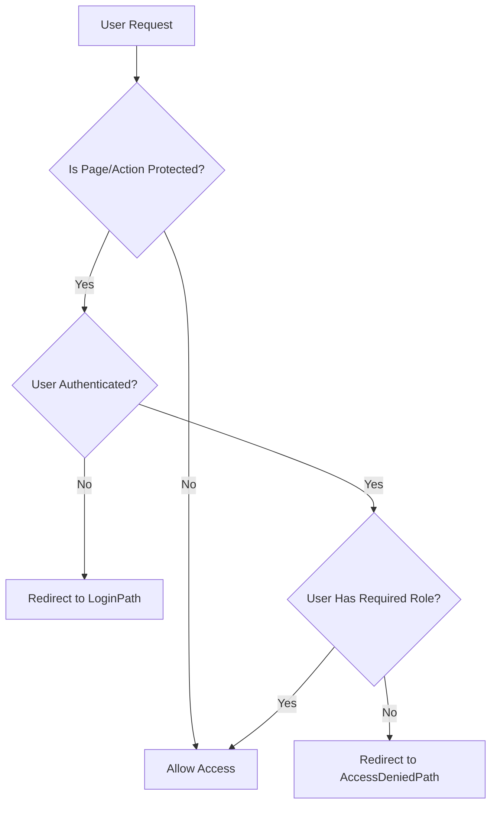

# 🛡️ Authorization in Swipe2Try

This document outlines the authorization mechanism implemented in the Swipe2Try application.

## 🧩 Core Components

### 1. ASP.NET Core Built-in Authorization
Swipe2Try utilizes ASP.NET Core's built-in authorization attributes and middleware:

- **`[Authorize]` Attribute**: Applied to controller actions or Razor Pages to restrict access.
- **Role-Based Authorization**: Implemented using `[Authorize(Roles = "RoleName")]` attribute.
- **Authentication Cookie**: Contains user identity and role claims.

Example of role-based authorization on a page:
```csharp
[Authorize(Roles = "Admin, Restaurant Owner")]
public class IndexModel : PageModel
{
    // Page model implementation
}
```

### 2. 🔑 Claims-Based Identity
User information and roles are stored as claims in the authentication cookie:

- **`ClaimTypes.Name`**: Stores the user's name.
- **`ClaimTypes.Email`**: Stores the user's email address.
- **`ClaimTypes.Role`**: Stores the role name (e.g., "Admin", "Restaurant Owner", "User").

These claims are created during login and stored in the authentication cookie:

```csharp
var claims = new List<Claim>
{
    new Claim(ClaimTypes.Name, user.Name),
    new Claim(ClaimTypes.Email, user.Email),
    new Claim(ClaimTypes.Role, roleName)
};
```

### 3. 🚀 Role Management
Roles are stored in the database and retrieved through the `IRoleManager` service:

- Each user has a `RoleID` property that references a role.
- During authentication, the role name is fetched from the database.
- The role name is then stored as a claim in the authentication cookie.

### 4. ⚠️ Error Handling for Authorization
When a user attempts to access a resource they're not authorized for:

- The user is redirected to the path specified in `options.AccessDeniedPath` ("/Error").
- The error page can display a specific message for unauthorized access.

## 🌊 Authorization Flow Diagram



## 👥 Access Control by Role

The application implements role-based access control with these primary roles:

| Role                | Access Areas                                   | Capabilities                                 |
|---------------------|------------------------------------------------|----------------------------------------------|
| **Admin**           | `/Admin/*`, All areas                          | Full system administration                   |
| **Restaurant Owner**| `/RestaurantOwner/*`, Limited admin functions  | Manage restaurant dishes and settings        |
| **User**            | `/swipe/*`, `/profile/*`, `/account/*`         | Basic user functionality                     |

## 👤 User Information Display

The user information is displayed in the UI using claims from the authenticated user:

```csharp
// Get user information from claims
UserName = User.Identity?.Name ?? "Guest";
UserRole = User.FindFirst(ClaimTypes.Role)?.Value ?? "Unknown";
```

The UI adapts based on the user's role, providing different colors and navigation options.

## 🔓 Logout Functionality

The application provides a logout mechanism through:

1. A logout button in the UI that links to the `/logout` endpoint.
2. The logout endpoint that calls `SignOutAsync` to clear the authentication cookie:

```csharp
public async Task<IActionResult> OnGetAsync()
{
    await HttpContext.SignOutAsync(CookieAuthenticationDefaults.AuthenticationScheme);
    return RedirectToPage("/Index");
}
```

This comprehensive authorization system ensures that users can only access areas and features appropriate for their assigned role, maintaining security throughout the application.
